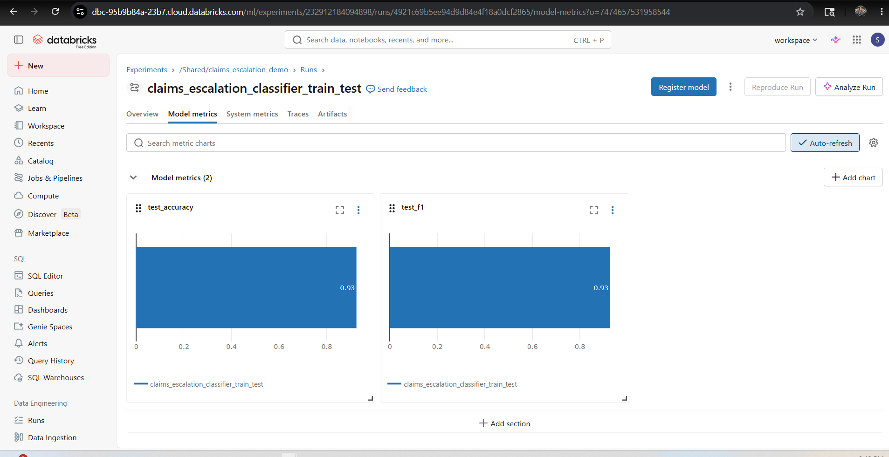
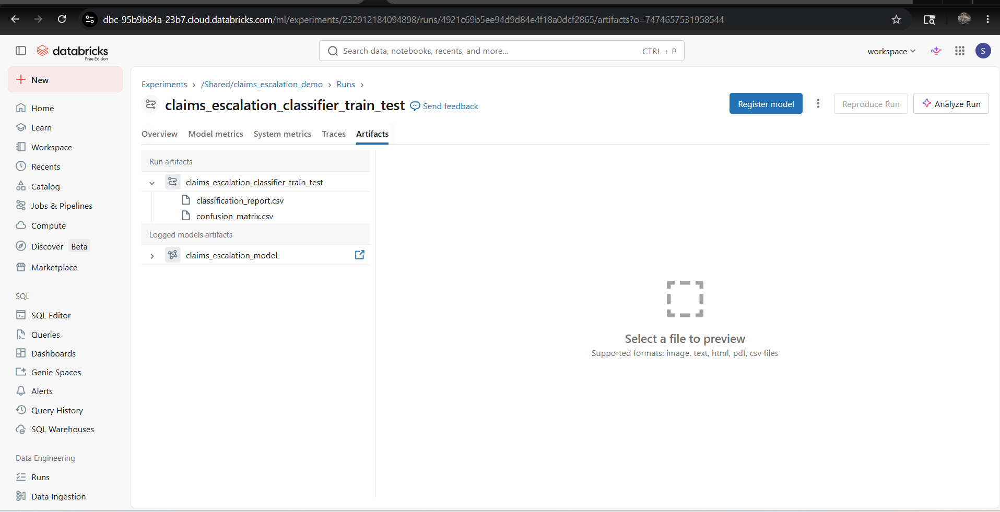

# Claims Escalation Classification with Databricks MLflow

Machine learning demo for predicting claims escalation risk using a Random Forest classifier with experiment tracking in Databricks MLflow.

The project demonstrates:
- synthetic claims classification data
- supervised binary classification
- experiment tracking with Databricks MLflow
- model evaluation and artifact logging

## Features
- Synthetic classification dataset generation
- RandomForestClassifier training pipeline
- Train/test split with stratification
- Accuracy and F1 evaluation metrics
- Classification report logging
- Confusion matrix artifact generation
- Databricks MLflow experiment tracking
- Registered model logging

## MLflow Tracking

The project logs:
- model hyperparameters
- accuracy and F1 metrics
- classification reports
- confusion matrices
- trained sklearn model artifacts

## Example MLflow Metrics and Artifacts on Databricks



## Example Artifacts
- `classification_report.csv`
- `confusion_matrix.csv`
- logged Random Forest model



## Tech Stack
- Python
- Scikit-learn
- Pandas
- MLflow
- Databricks

## Run Locally

```bash
python databricks_demo.py
```

## Databricks MLflow Experiment

```python
mlflow.set_tracking_uri("databricks")
mlflow.set_experiment("/Shared/claims_escalation_demo")
```