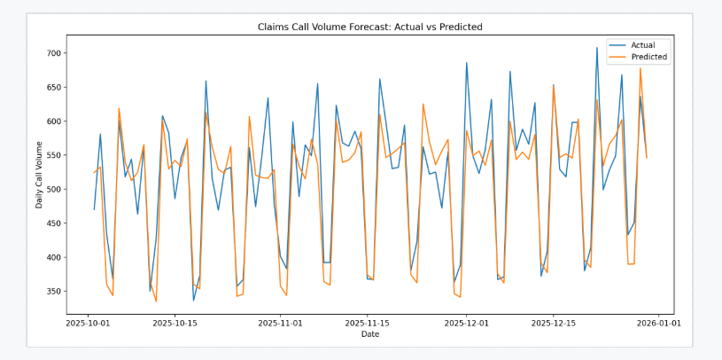
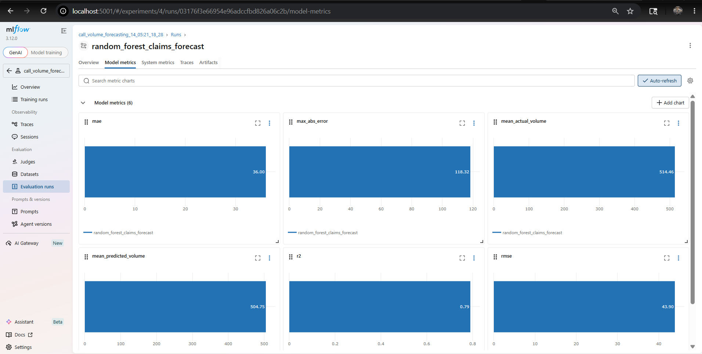

# Claims / Call Center Volume Forecasting

Synthetic healthcare claims and call-center forecasting pipeline built with Random Forest regression, engineered time-series features, and MLflow experiment tracking.

The project simulates operational workloads with:
- weekly and annual seasonality
- growth trends
- random operational noise
- event-driven spikes



## Features
- Synthetic time-series data generation
- Lag and rolling-window forecasting features
- RandomForestRegressor forecasting model
- Time-based train/test split
- MLflow experiment tracking
- Forecast visualization and feature importance plots
- Saved prediction and artifact outputs

## MLflow Metrics



## Example Artifacts
- Forecast vs Actual plots
- Feature importance charts
- Prediction CSV outputs
- Logged MLflow experiments

## Tech Stack
- Python
- Pandas
- NumPy
- Scikit-learn
- MLflow
- Matplotlib

## Run locally, or use the notebooks

```bash
python train_forecast_mlflow.py
```

## Launch MLflow UI

```bash
mlflow server --backend-store-uri ./mlruns --host 127.0.0.1 --port 5001
```

Then open:

```text
http://localhost:5001
```